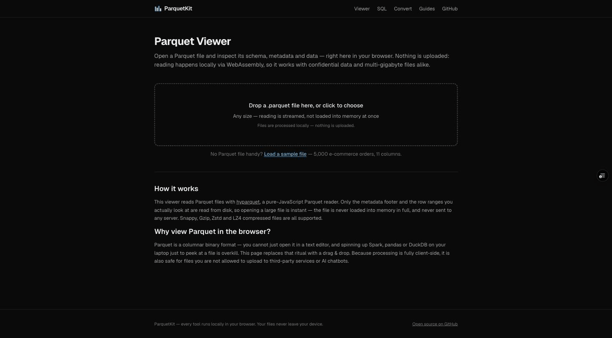
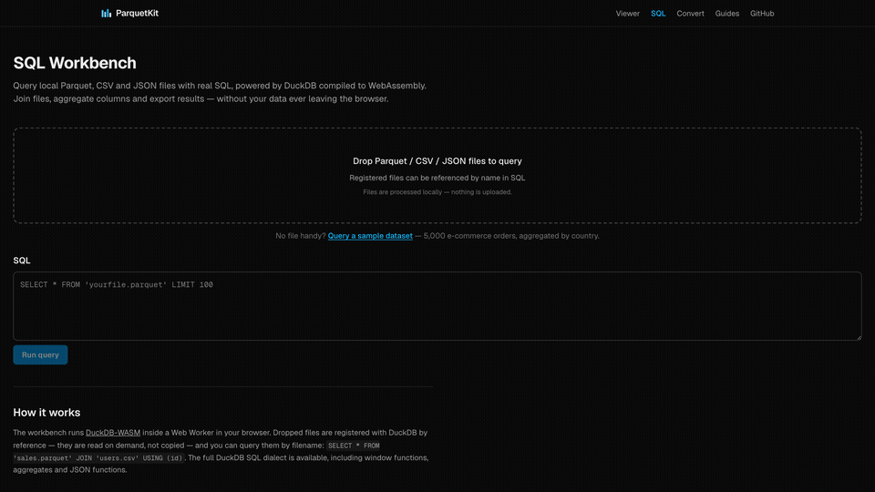

<div align="center">
  
  <h1>ParquetKit</h1>
  <p><strong>View, query and convert Parquet files — entirely in your browser.</strong></p>
  <p>
    <a href="https://github.com/XxxKMSxxX/parquetkit/actions/workflows/ci.yml"></a>
    <a href="./LICENSE"></a>
    <a href="https://github.com/XxxKMSxxX/parquetkit/releases"></a>
    <a href="https://github.com/sponsors/XxxKMSxxX"></a>
  </p>
  <p>
    <a href="https://parquetkit.com"><strong>parquetkit.com</strong></a> ·
    <a href="https://parquetkit.com/parquet-viewer">Viewer</a> ·
    <a href="https://parquetkit.com/sql">SQL Workbench</a> ·
    <a href="https://parquetkit.com/docs">Guides</a> ·
    <a href="https://github.com/XxxKMSxxX/parquetkit/discussions">Discussions</a>
  </p>
</div>

---

No upload. No signup. No server. Every tool runs locally via WebAssembly,
which makes it safe for confidential data and fast for multi-gigabyte files —
there is nowhere to send your file, and you can verify that in this repo.

*The Parquet Viewer opening the sample dataset — schema, metadata and rows appear instantly:*



## Tools

| Tool | What it does |
|---|---|
| [Parquet Viewer](https://parquetkit.com/parquet-viewer) | Drop a `.parquet` file → schema, metadata, paginated rows. Opens a 1.3 GB file in ~350 ms because only the metadata footer and visible row ranges are read. |
| [SQL Workbench](https://parquetkit.com/sql) | Full DuckDB SQL against local Parquet / CSV / JSON files. Joins across files, window functions, CSV export. |
| [Converters](https://parquetkit.com/convert/parquet-to-csv) | Parquet ⇄ CSV / JSON / JSONL, streamed by DuckDB with ZSTD output. |

*The SQL Workbench aggregating the same dataset with DuckDB:*



## Architecture

```
Next.js (App Router, output: 'export')  →  pure static HTML on a CDN
 ├─ hyparquet (~10 KB)   instant metadata/preview reads, streamed via Blob.slice
 └─ DuckDB-WASM          SQL + conversions, lazy-loaded, runs in its own Web Worker
```

- **There is no backend.** The site is a static export; there is nowhere to
  upload a file to. This is the privacy guarantee, verifiable in this repo
  and in your browser's network tab — once the page and engine are loaded,
  the tools keep working even with the network disconnected.
- **Two engines by design.** hyparquet gives instant first paint on drop;
  DuckDB loads on demand only when you query or convert.
- **Files are registered by reference** (`registerFileHandle`), not copied —
  memory stays flat for large files.
- **Monitoring is scrubbed.** Sentry's `beforeSend` drops file names, file
  contents and query strings. Analytics is cookieless.

## Development

```bash
pnpm install
pnpm dev

pnpm lint && pnpm typecheck   # static checks (engine layer is React-free, enforced by ESLint)
pnpm test:unit                # hyparquet round-trips, SQL generation, content schema
pnpm test:browser             # DuckDB integration on real Chromium (vitest browser mode)
pnpm build && pnpm test:e2e   # Playwright against the static export
```

Test fixtures are generated by `uv run scripts/generate_fixtures.py`
(pyarrow) and committed, covering every compression codec and the major
logical types.

## Content

Tool pages under `/convert/*` and guides under `/docs/*` are driven by
Markdown files in `content/` with zod-validated frontmatter. Raw HTML is not
rendered (and CI rejects it), so content changes are structurally safe — a
PR that only touches `content/**` auto-merges once CI passes.

## Contributing

Bug reports, questions and ideas are very welcome — please use
[issues](https://github.com/XxxKMSxxX/parquetkit/issues) and
[discussions](https://github.com/XxxKMSxxX/parquetkit/discussions). Pull
requests are generally not accepted: ParquetKit is open source, but not open
contribution. See [CONTRIBUTING.md](./CONTRIBUTING.md) for details.

## License

[MIT](./LICENSE) © 2026 Shun Kimura

Built with [hyparquet](https://github.com/hyparam/hyparquet) (MIT),
[DuckDB-WASM](https://github.com/duckdb/duckdb-wasm) (MIT) and
[Apache Arrow](https://github.com/apache/arrow-js) (Apache-2.0).

Apache Parquet, Apache Arrow and their logos are trademarks of the
[Apache Software Foundation](https://www.apache.org/). ParquetKit is an
independent project and is not affiliated with or endorsed by the ASF.
